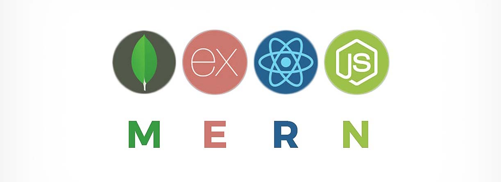

# MERN Stack custom template


</img>

**I haven't found any good full-stack web app starter boilerplates using [Ant Design](https://ant.design), so I decided to make my own.**

**Feel free to use it on your projects.**

## Features

- [x] Landing Page
- [x] Sleek and modern design with the Ant Design library
- [x] Protected Routes:

  - [x] Dashboard
  - [ ] Profile

- [x] REST API Backend
- [x] Authentication with JWT
- [x] MongoDB Connection

## Usage

```bash
# Clone repository
git clone https://github.com/nicolas-racchi/mern-template.git
cd mern-template

# Install all dependencies both for client, server and wrapper folder.
cd client && npm install && cd ../server && npm install && cd .. && npm install
```

Then, connect your mongoDB database:
inside the `server` folder, create a file called `.env` and add the mongo connectionstring.

```bash
# Example (./server/.env)
NODE_ENV=development
DATABASE_URL=my_mongo_connection_string
```

A `.env.sample` file is provided in the server folder so you always know what are the required environment variables.

```bash
# Run client & server concurrently
npm run dev
```

## Other useful things

- **Locales**: Ant design supports language locales. As default, this template uses en_US (english). To change this setting to your own language, open `client/index.js` and change en_US to your own language based on locale tags (find some of them [here](https://www.oracle.com/java/technologies/javase/jdk8-jre8-suported-locales.html#util-text))
